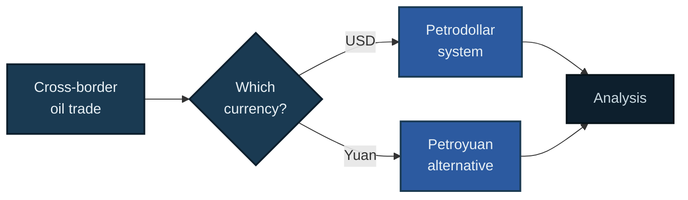

cat > README.md << 'EOF'
# Same Rails, New Owner?

An analysis of whether the strategic monetary alliance between the Gulf states and the USA, informally known as the petrodollar system, has begun to run out of fuel.

[](https://www.python.org/)
[](LICENSE)
[]()

## Contents

- [Overview](#overview)
- [The Question](#the-question)
- [Approach](#approach)
- [Quick Start](#quick-start)

## Overview

_Placeholder. To be written once the research phase is complete._



## The Question

_Placeholder. Will be defined precisely once the academic and institutional grounding is in place._

## Approach

_Placeholder. Python and R for transaction flow analysis, a forecasting component grounded in an established academic method, and a demonstration smart contract for a tokenised oil transaction._

## Quick Start

```bash
git clone https://github.com/alexander-jhughes/petrodollar-rails.git
cd petrodollar-rails
python3 -m venv .venv
source .venv/bin/activate
pip install -r requirements.txt
```

## Status

Research phase. Reading academic and institutional sources before any modelling begins.

This is independent academic research, not affiliated with any employer. Educational purposes only, not financial or investment advice.
EOF