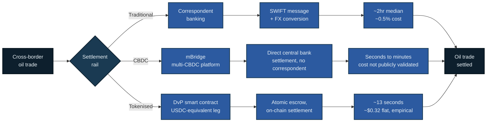

# Dollar Dominance in the Age of Tokenisation

A simplified model examining whether the strategic monetary alliance between the Gulf states and the USA, informally known as the petrodollar system, has begun to run out of fuel.

[](https://www.python.org/)
[](https://www.r-project.org/)
[](LICENSE)
[](https://sepolia.etherscan.io/address/0xFC6aEe59057063aD75FB7C3f53E78dd204Dd5b02)

## Contents

- [Overview](#overview)
- [The Question](#the-question)
- [Approach](#approach)
- [Settlement Rails Compared](#settlement-rails-compared)
- [Quick Start](#quick-start)
- [Limitations](#limitations)
- [Further Research](#further-research)
- [Disclaimer](#disclaimer)
- [References](#references)

## Overview

Profits in the oil-rich Gulf states surged through the 1970s, facilitating a fundamental transformation in the relationship between the Middle East and North Africa and the international order the US had built post-WW2. The collapse of Bretton Woods in the prior years, decoupling the fixed relationship between the US dollar and the gold standard, caused stagflation to hit the US economy. US officials therefore aimed to uphold the strength of the dollar. As reported in the *Financial Times* (Blustein, 2026), an unofficial deal was signed in 1974 between the US and Saudi Arabia. This involved Riyadh using dollars for selling oil and investing proceeds, with the US providing military protection and aid in response. This spread to the rest of the developing MENA region and became what we refer to today as the petrodollar system.

**Why the dollar?** As touched on by Eichengreen in his seminal work on the dollar's international reign, *Exorbitant Privilege* (2011), the alternative currencies at the time were not structurally suited to the role:

- **Deutschmark**: belonged to an economy a fraction the size of the US; Germany was not a big supplier of attractive financial securities, its budget was balanced, its financial system bank-based. The Bundesbank actively discouraged foreign accumulation, warning Iran off converting reserves into deutschmarks in 1979.
- **Yen**: Japan's bond markets were too shallow, and Tokyo itself resisted internationalising the currency.
- **SDR**: the IMF's Special Drawing Right was never used to invoice or settle trade, or in private financial transactions, so never became attractive for governments' own use.

**Recent de-dollarisation.** Kilinc and Ali (2026) examine de-dollarisation-related macro-financial conditions across BRICS+ economies (Brazil, Russia, India, China, South Africa, Egypt, Indonesia, Saudi Arabia) between 2000 and 2024, finding exchange-rate dynamics and external financial conditions significantly shape these economies' resilience during the process. New payment infrastructure has emerged alongside this shift:

- **mBridge**: began 2021, a collaboration between China, Hong Kong, and Thailand with BIS logistical support. The UAE joined shortly after, Saudi Arabia's central bank in 2024. Lets participating banks exchange CBDCs directly, without a correspondent intermediary.
- The BIS later withdrew amid Western concern the platform could be used to circumvent sanctions, a reminder that the binding constraint tends to be political governance rather than purely technical capability.

That same year, the BIS launched Project Agorá, using the same technology with seven Western central banks and 40+ institutions (JPMorgan, Citi, HSBC, SWIFT) testing the same tokenised-deposit approach, minus any mBridge participant.

> **This project** tests whether the conditions for petrodollar erosion actually hold, using three approaches: a Python transaction-cost analysis, an R reserve-econometrics analysis, and a deployed smart contract demonstrating settlement of an example tokenised oil transaction.

**Why the UAE.** The UAE sits at the centre of this question: a founding-adjacent mBridge participant, an active builder of tokenised infrastructure (ADGM, ADX, the Digital Dirham), and a currency long pegged to the dollar. It is consequently enmeshed in all three rails examined here simultaneously. Whilst individual-country COFER data doesn't exist publicly, this project uses the UAE's institutional posture, not country-level reserve data, as the Gulf anchor.

## The Question

Is US reserve dominance genuinely under threat from digital alternatives, and what are the implications for economies with pegged dollar ties, such as the UAE, now navigating traditional rails, tokenised USDC, and mBridge simultaneously?

This project examines whether the dollar has meaningfully declined in use, and what the evidence implies for its trajectory going forward.

## Approach

**Transaction cost and speed analysis** — `transaction_costs.ipynb`

- 1,000 real USDC transactions retrieved via the Etherscan API, live ETH pricing from CoinGecko
- Transactions below $1 USDC value excluded as likely dust transfers; 687 of 1,000 retained for cost analysis
- Benchmarked against correspondent banking (Oliver Wyman/JPMorgan, ~0.5% of value; CPMI/FSB SWIFT gpi on speed) and BIS-reported mBridge pilot figures, the latter cited as text only, since no validated per-transaction figure exists
- **Result:** median USDC fee ≈ 0.038% of transaction value, falling to ≈ 0.0006% above $10,000, reflecting the largely fixed nature of gas costs regardless of transfer size

**Reserve composition econometrics** — `reserve_causality_analysis.R`

- IMF COFER world-aggregate data (individual-country breakdowns are confidential); methodology follows Chinn and Frankel (2007, 2008) as applied by Arslanalp, Eichengreen and Simpson-Bell (2022), with Ito and McCauley (2020) providing context on the limits of publicly reconstructed country-level reserve data
- USD reserve share, 1999–2025; RMB reserve share, 2016–2025 (COFER did not report RMB separately before Q4 2016)
- Augmented Dickey-Fuller stationarity test (Said and Dickey, 1984)
- Granger causality, both directions, lag fixed at 1 a priori rather than selected post hoc, per the overfitting/p-hacking risk in Bruns and Stern (2019)
- Logit-transformed OLS substitution regression, following Chinn and Frankel (2007, 2008) as applied in Arslanalp, Eichengreen and Simpson-Bell (2022)
- **Result:** USD share is trend-stationary (ADF p = 0.019, n = 27); Granger causality inconclusive in both directions (p = 0.938, p = 0.281, n = 10); USD inertia coefficient ≈ 1.03 (p < 0.001), RMB substitution not significant (p = 0.149)

**Smart contract demonstration** — `contracts/`

- Delivery-versus-payment escrow contract, designed, tested, deployed to Ethereum Sepolia
- Demonstrates settlement mechanics for a tokenised oil trade, validated automatically on-chain rather than through a trusted intermediary
- Ethereum chosen as the current, industry-wide venue of adoption for USDC specifically
- A real settlement transaction has been executed and is publicly verifiable on Sepolia Etherscan, see [contracts/README.md § Run It Yourself](contracts/README.md#run-it-yourself)

Together, these approaches address the question from three separate angles: whether alternative settlement infrastructure is genuinely cost-competitive, whether the reserve data shows measurable statistical substitution towards the renminbi, and whether the settlement mechanism is technically viable to build and deploy today.

## Settlement Rails Compared



| Rail | Typical cost | Speed | Basis |
|---|---|---|---|
| Correspondent banking | ~0.5% of value | ~2hr median, 92.7% within 1 business day | Oliver Wyman/JPMorgan; CPMI/FSB SWIFT gpi |
| mBridge (CBDC) | not publicly validated | seconds to minutes | BIS pilot report, cited context only |
| USDC (Ethereum) | ~0.038% typical, ~0.0006% at $10k+ | ~12 seconds | Empirical, 687 of 1,000 mainnet transactions ≥$1 |
| DvP smart contract | ~$0.32 flat | ~13 seconds | Empirical, this repository's `settle()` call on Sepolia |

## Quick Start

```bash
git clone https://github.com/alexander-jhughes/dollar-tokenisation-analysis.git
cd dollar-tokenisation-analysis
python3 -m venv .venv
source .venv/bin/activate
pip install -r requirements.txt
```

Smart contract demonstration, including a runnable example: see [contracts/README.md](contracts/README.md).

## Limitations

- **No single de-dollarisation indicator exists.** Consistent annual data isn't available across all the series this project would ideally use, a stated limitation of the underlying literature, not only of this project. This may alter both econometric analysis results and correlation findings.
- **Stablecoins may actually reinforce, not erode, dollar dominance.** Eichengreen (2026) notes the large majority of stablecoin value is dollar-linked, so growth in stablecoin usage is arguably growth in dollar usage by another name. A CBDC-to-CBDC transaction between non-US economies would still typically require dollar conversion at some stage, carrying its own costs.
- **Python analysis is Ethereum-specific.** Various other chains, including the Solana network, offer materially lower fees. Figures here represent USDC-on-Ethereum specifically, the current dominant venue by volume, not broader tokenised settlement. mBridge figures are drawn from a single BIS pilot report, not live validated statistics.
- **R analysis is sample-size constrained.** COFER's RMB share has only been tracked separately since Q4 2016 (n = 10 overlapping years for Granger tests, n = 27 for the USD stationarity test); results should be read as inconclusive rather than evidence of independence.
- **Smart contract gas costs are testnet-derived.** Sepolia does not always mirror mainnet gas pricing exactly, and real-world costs are variable and subject to network demand. A faster or cheaper rail is arguably not unambiguously beneficial to a dollar-pegged economy: lower friction can facilitate capital flight at a lower opportunity cost for investors.
- **Correspondent banking benchmark is a 2020 baseline.** The ~0.5% figure (Oliver Wyman/JPMorgan) reflects 2020 transaction volumes and costs, not adjusted for inflation or any changes to correspondent banking pricing since. It is therefore used as a stable, widely-cited reference point rather than a claim about current-year costs.

## Further Research

The BIS's 2023 "unified ledger" blueprint (Chapter III, BIS Annual Economic Report 2023) frames Project Agorá as a practical step towards this vision: a shared, programmable platform combining tokenised central bank reserves, tokenised deposits, and tokenised assets, aimed at the same reconciliation and settlement frictions this project's smart contract addresses at a much smaller scale. Agorá has grown from seven to eight participating central banks and now involves over 40 financial institutions, and reports having delivered a working prototype demonstrating atomic, multi-currency settlement (BIS, 2026). Whether this scales into production infrastructure, and whether Gulf institutions gain access to it, is a live and developing question beyond the scope of this project.

## Disclaimer

This is independent academic research, not affiliated with any employer. Educational purposes only, not financial or investment advice.

## References

Arslanalp, S., Eichengreen, B. and Simpson-Bell, C. (2022) 'The Stealth Erosion of Dollar Dominance: Active Diversifiers and the Rise of Nontraditional Reserve Currencies', *Journal of International Economics*, 138.

Bank for International Settlements (2022) *Project mBridge: Connecting Economies through CBDC*. BIS Innovation Hub report, October. Available at: https://www.bis.org/publ/othp59.htm

Bank for International Settlements (2023) 'Blueprint for the Future Monetary System: Improving the Old, Enabling the New', *BIS Annual Economic Report*, Chapter III, 20 June. Available at: https://www.bis.org/publ/arpdf/ar2023e3.htm

Bank for International Settlements (2026) *Project Agorá: Exploring Tokenisation of Wholesale Cross-Border Payments*. BIS Innovation Hub report, 27 May.

Blustein, P. (2026) 'Much ado about the 1974 "petrodollar" deal', *Financial Times*, 28 April. Available at: https://www.ft.com/content/a65efb54-306b-49ad-9920-40d59b195623 (Accessed: 26 August 2026).

Bruns, S.B. and Stern, D.I. (2019) 'Lag Length Selection and P-Hacking in Granger Causality Testing: Prevalence and Performance of Meta-Regression Models', *Empirical Economics*, 56(3), pp. 797-830.

Chinn, M. and Frankel, J. (2007) 'Will the Euro Eventually Surpass the Dollar as Leading International Reserve Currency?', in Clarida, R. (ed.) *G7 Current Account Imbalances: Sustainability and Adjustment*. Chicago: University of Chicago Press, pp. 283-338.

Chinn, M. and Frankel, J. (2008) 'Why the Euro Will Rival the Dollar', *International Finance*, 11(1), pp. 49-73.

Eichengreen, B. (2011) *Exorbitant Privilege: The Rise and Fall of the Dollar and the Future of the International Monetary System*. Oxford: Oxford University Press.

Eichengreen, B. (2026) *Money Beyond Borders: Global Currencies from Croesus to Crypto*. Princeton: Princeton University Press.

Ito, H. and McCauley, R.N. (2020) 'Currency Composition of Foreign Exchange Reserves', *Journal of International Money and Finance*, 102.

Kilinc, N. and Ali, I. (2026) 'De-Dollarization, Global Economic Integration, and Resilience in BRICS+ Economies', *Economies*, 14(7), 277. https://doi.org/10.3390/economies14070277

Said, S.E. and Dickey, D.A. (1984) 'Testing for Unit Roots in Autoregressive-Moving Average Models of Unknown Order', *Biometrika*, 71(3), pp. 599-607.

Spiro, D.E. (1999) *The Hidden Hand of American Hegemony: Petrodollar Recycling and International Markets*. Ithaca: Cornell University Press.