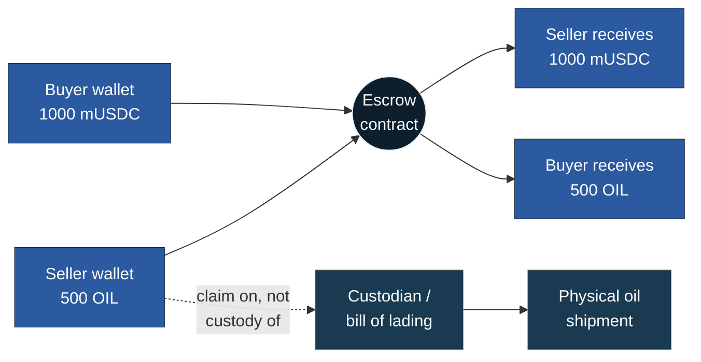

# Oil Trade Settlement Demo

A minimal, atomic delivery-versus-payment (DvP) escrow smart contract demonstrating a tokenised settlement transaction for a cross-border oil trade.

[](https://soliditylang.org/)
[](https://hardhat.org/)
[](LICENSE)
[](https://sepolia.etherscan.io/address/0xFC6aEe59057063aD75FB7C3f53E78dd204Dd5b02)
[](https://sepolia.etherscan.io/tx/0x8b9696334ca242b9383eec9706d6d710efecf309e7fa891df7c04986d289aceb)

## Contents

- [What This Demonstrates](#what-this-demonstrates)
- [How the Settlement Works](#how-the-settlement-works)
- [Contracts](#contracts)
- [Run It Yourself](#run-it-yourself)
- [Live on Sepolia](#live-on-sepolia)
- [Settlement Cost](#settlement-cost)
- [Testing](#testing)
- [Limitations](#limitations)

## What This Demonstrates

A buyer and seller each deposit their leg of a trade into an escrow contract. Settlement is atomic: neither leg is released until both have been deposited and both parties pass a pre-determined compliance allowlist check. If only one party deposits and the other never arrives, the depositor can reclaim their funds after a fixed deadline.

This mirrors 2026 institutional DvP pilots (the UK's GBTD, Hong Kong's EnsembleTX, BIS Project Agorá), which increasingly favour tokenised deposits over public stablecoins as the cash leg. The contract uses a mock ERC-20 for public-testnet demonstrability.

## How the Settlement Works

The contract represents a simplified cross-border oil trade: a buyer holds a cash-leg token (`MockUSDC`, standing in for a dollar-equivalent settlement asset) and a seller holds an oil-leg token (`ExampleOilToken`, standing in for a tokenised claim on a physical oil shipment). Real-world tokenised commodity trades typically represent ownership of a specific, verified quantity of the underlying asset, held or audited by a custodian; this contract does not implement that custody layer, it is intended solely to illustrate the settlement mechanics underlying such a system.



Both legs are deposited into escrow, and the atomic swap only executes once both are present and both parties pass the compliance allowlist. This ensures a buyer cannot pay without receiving the oil-leg token, and a seller cannot deliver without receiving payment.

## Contracts

- `MockUSDC.sol`: mintable ERC-20 standing in for the cash leg (6 decimals, matching real USDC convention)
- `ExampleOilToken.sol`: mintable ERC-20 standing in for the tokenised commodity leg (18 decimals)
- `OilTradeSettlement.sol`: the DvP escrow contract: deposit, atomic settle, and timeout/refund logic, gated by a compliance allowlist

## Run It Yourself

Deploy your own contract instance and watch a real settlement execute, with your own transaction hash and gas cost printed to your terminal.

```bash
cd contracts
npm install
npx hardhat compile
```

Create two Sepolia wallets and a free [Alchemy](https://www.alchemy.com/) RPC endpoint, fund both wallets via the [Alchemy faucet](https://www.alchemy.com/faucets/ethereum-sepolia), then set:

```bash
cat > .env << 'EOF'
BUYER_ADDRESS=
BUYER_PRIVATE_KEY=
SELLER_ADDRESS=
SELLER_PRIVATE_KEY=
SEPOLIA_RPC_URL=
EOF
```

Deploy, then run a trade:

```bash
npx tsx scripts/deploy.ts   # copy the three printed addresses into .env
npx tsx scripts/run-trade.ts
```

Output shows minting, approvals, both deposits, and the atomic settlement, ending in a real transaction hash and gas cost.

## Live on Sepolia

| Contract | Address |
|---|---|
| MockUSDC | [`0xd73d8C0d7464fa45fa0503b551ae2A89ADB049eB`](https://sepolia.etherscan.io/address/0xd73d8C0d7464fa45fa0503b551ae2A89ADB049eB) |
| ExampleOilToken | [`0xab7D416Bd2B14e450d55146758B48AFB5509BFA1`](https://sepolia.etherscan.io/address/0xab7D416Bd2B14e450d55146758B48AFB5509BFA1) |
| OilTradeSettlement | [`0xFC6aEe59057063aD75FB7C3f53E78dd204Dd5b02`](https://sepolia.etherscan.io/address/0xFC6aEe59057063aD75FB7C3f53E78dd204Dd5b02) |

A complete, real trade (mint, approve, deposit both legs, atomic settlement) has been executed on these contracts. The settlement transaction is publicly verifiable: [`0x8b9696334ca242b9383eec9706d6d710efecf309e7fa891df7c04986d289aceb`](https://sepolia.etherscan.io/tx/0x8b9696334ca242b9383eec9706d6d710efecf309e7fa891df7c04986d289aceb).

## Settlement Cost

| Rail | Cost | Basis |
|---|---|---|
| Correspondent banking | ~0.5% of trade value | Oliver Wyman/JPMorgan benchmark |
| Plain USDC transfer | ~0.038% typical, ~0.0006% at $10k+ | Empirical, 687 of 1,000 mainnet transactions ≥$1 |
| DvP contract settlement | ~$0.32 flat (0.00013 ETH) | Empirical, this contract's `settle()` call on Sepolia |

The DvP settlement cost is essentially fixed regardless of trade size, the same pattern observed in the parent USDC analysis: negligible at institutional scale, disproportionate on small trades.

## Testing

Four scenarios verified via Hardhat's test suite (`test/OilTradeSettlement.test.ts`):

- Successful settlement when both legs are deposited
- Settlement correctly reverts when only one leg has deposited
- Refund correctly returns funds to the depositor after the deadline passes with no counterparty
- Deposit correctly reverts for a non-allowlisted address

```bash
npx hardhat test
```

## Limitations

Gas cost figures are drawn from Sepolia testnet, which does not always mirror mainnet gas market pricing exactly, though it is representative of the order of magnitude for this kind of settlement transaction.